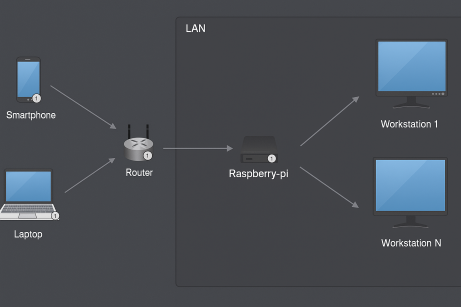

# Zig-wol

Written in the [Zig](https://github.com/ziglang/zig) programming language, [zig-wol](https://github.com/rktr1998/zig-wol) is a CLI utility for sending wake-on-lan magic packets to wake up a computer in a LAN given its MAC address.

## Features

- Send WOL magic packets to wake up devices on the LAN.
- Cross-platform support for windows, macos and linux for both x86_64 and aarch64 architectures.

## Installation

Pre-compiled binaries of [zig-wol](https://github.com/rktr1998/zig-wol) are distributed with [releases](https://github.com/rktr1998/zig-wol/releases): download the binary for your architecture and operating system and you are good to go!

### Install latest on Windows using PowerShell

```pwsh
Invoke-RestMethod "https://raw.githubusercontent.com/rktr1998/zig-wol/refs/heads/main/install/install-latest-on-windows.ps1" | Invoke-Expression
```

This command downloads the latest release for your processor architecture and **installs** the program at `C:\Users\%username%\.zig-wol`. To **uninstall** zig-wol, simply delete this folder.

### Install latest on Linux

```sh
bash <(curl -sSL https://raw.githubusercontent.com/rktr1998/zig-wol/refs/heads/main/install/install-latest-on-linux.sh)
```

This command downloads the latest release for your processor architecture and **installs** the program at `/home/$USER/.zig-wol`. To **uninstall** zig-wol, simply delete this folder.

### Install latest on MacOS

```sh
bash <(curl -sSL https://raw.githubusercontent.com/rktr1998/zig-wol/refs/heads/main/install/install-latest-on-macos.sh)
```

This command downloads the latest release for your processor architecture and **installs** the program at `/home/$USER/.zig-wol`. To **uninstall** zig-wol, simply delete this folder.

## Usage

Wake a machine on your LAN by broadcasting the magic packet: replace `<MAC>` with the target MAC address (e.g. `9A-63-A1-FF-8B-4C`).

```sh
zig-wol wake <MAC>
```

Create an alias for a MAC address, list all aliases or remove one.

```sh
zig-wol alias <NAME> <MAC> --address <ADDR>   # create an alias and set its broadcast
zig-wol wake <NAME>                           # wake a machine by alias
```

The optional `--address` (e.g. 192.168.0.255) is important if there are multiple network interfaces. Setting the correct subnet broadcast address ensures the OS chooses the right network interface. If not specified, the default broadcast 255.255.255.255 address is used.

Run `zig-wol help` to display all subcommands and `zig-wol <subcommand> --help` to display specific options.

## Build

### Prerequisites

- [Zig (v0.15.1)](https://ziglang.org/download/) installed on your system.

### 1. Clone the Repository

```sh
git clone https://github.com/rktr1998/zig-wol.git
cd zig-wol
```

### 2. Build the Application

```sh
zig build
```

This command compiles the source code and places the executable in the `zig-out/bin/` directory.

## As a library

It is possible to use the wake-on-lan functionality of this project as a library.

```sh
zig fetch --save=wol git+https://github.com/rktr1998/zig-wol
```

Add the wol module from the fetched dependency in build.zig.

```c
const wol_module = b.dependency("wol", .{}).module("wol");
exe.root_module.addImport("wol", wol_module); // e.g. add it to an exe
```

Import the module in Zig.

```c
const wol = @import("wol");
```

## Remote wake-on-lan

Using the subcommand **relay** it is possible to make zig-wol work as a beacon that listens on `--listen_address` for inbound wake-on-lan magic packets and relays them to a `--relay_address`.
The parameters --listen_port and --relay_port are optional and default to port 9 if unspecified, it is recomended to specify two different port numbers.

```sh
zig-wol relay --listen_address 192.168.0.10 --listen_port 9999 --relay_address 192.168.0.255 --relay_port 9
```

A realistic example usage, using the command above as a reference, is to have a home LAN comprised of one or more powerful machines that need to be woken remotely and an always-on low-power machine, like a raspberry-pi, that runs the `zig-wol relay` repeater.
Enable port-forwarding in the router settings to forward inbound traffic from some specific port of choice to 9999/udp of the raspberry-pi, then zig-wol relay service relays the magic packets on the local subnet broadcast allowing to wake the other machines from outside the LAN, provided the router public address is known.



### As a service on Linux

Ensure you have zig-wol and set net permissions to the binary.

```sh
sudo chmod +x /home/USERNAME/.zig-wol/zig-wol
sudo setcap 'cap_net_bind_service=+ep' /home/USERNAME/.zig-wol/zig-wol
```

Firewall rules (based on the example above).

```sh
sudo ufw allow in proto udp to any port 9999
sudo ufw allow out proto udp to any port 9
sudo ufw reload
```

Create the service file, set the USERNAME and addresses accordingly.

```sh
sudo tee /etc/systemd/system/zig-wol.service > /dev/null <<EOF
[Unit]
Description=zig-wol
After=network-online.target
Wants=network-online.target
StartLimitBurst=5
StartLimitIntervalSec=60s

[Service]
Type=simple
User=USERNAME
AmbientCapabilities=CAP_NET_BIND_SERVICE
CapabilityBoundingSet=CAP_NET_BIND_SERVICE
WorkingDirectory=/home/USERNAME/.zig-wol
ExecStartPre=/bin/sleep 5
ExecStart=/home/USERNAME/.zig-wol/zig-wol relay \\
  --listen_address=192.168.0.10 --listen_port=9999 \\
  --relay_address=192.168.0.255 --relay_port=9
Restart=on-failure
RestartSec=10s

[Install]
WantedBy=multi-user.target
EOF

```

Reload, enable and start the service.

```sh
sudo systemctl daemon-reload
sudo systemctl enable zig-wol.service
sudo systemctl start zig-wol.service
```

Monitor the service.

```sh
sudo systemctl status zig-wol.service
sudo journalctl -u zig-wol.service -f
```

## License

This project is licensed under the MIT License. See the [LICENSE](LICENSE) file for details.
